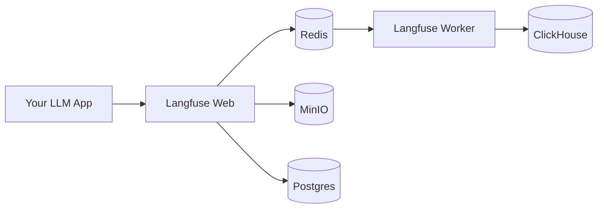

# Langfuse for Agentic LLM Apps

This project sets up a **self-hosted Langfuse** stack for logging and tracing LLM/agent applications.  
It is designed for local experimentation first (on a MacBook Pro, dev machines), with the ability to later move to the cloud.

---

## Why This Project?

LLM applications behave like *black boxes* without observability.  
Langfuse gives you:

- **Tracing**: Step-by-step record of prompts, tool calls, and responses.
- **Metrics**: Token usage, latency, error rates, cost breakdowns.
- **Debugging**: Replay sessions when things go wrong.
- **Scaling**: Handles millions of events using ClickHouse.

This repo shows how to self-host Langfuse for agentic apps, with all dependencies (Postgres, ClickHouse, Redis, MinIO, Zookeeper) orchestrated via Docker Compose.

---

## Architecture

Langfuse uses several components under the hood:

- **Langfuse Web** → the UI + API (dashboard at `http://localhost:3001`)  
- **Langfuse Worker** → processes and ingests events asynchronously  
- **Postgres** → config + metadata  
- **ClickHouse** → high-volume trace/event storage  
- **Redis** → queuing + caching  
- **MinIO** → S3-compatible object storage for large payloads  
- **Zookeeper** → required for ClickHouse replication setup  



---

## Setup

1. **Clone this repo**  
   ```bash
   git clone https://github.com/<yourname>/langfuse_for_agentic.git
   cd langfuse_for_agentic
   ```

2. **Configure environment**  
   Copy `.env.example` to `.env` and set:
   - `POSTGRES_PASSWORD`, `REDIS_AUTH`
   - `MINIO_ROOT_USER`, `MINIO_ROOT_PASSWORD`
   - `NEXTAUTH_SECRET`, `SALT`, `ENCRYPTION_KEY`

3. **Start services**  
   ```bash
   ./scripts/start_langfuse.sh
   ```
   (This script ensures clean restarts if something breaks.)

4. **Open dashboard**  
   Visit: [http://localhost:3001](http://localhost:3001)

---

## Why Different Ports?

We changed default ports to avoid conflicts with local services:

- `3001` → Langfuse UI (instead of `3000`, which was already in use by Docker Desktop)  
- `5433` → Postgres inside Docker (local Postgres was already using `5432`)  
- `6380` → Redis inside Docker (to avoid clashing with local Redis on `6379`)  
- `8124` → ClickHouse HTTP (instead of default `8123`)  
- `9001` → ClickHouse native port (instead of `9000`)  
- `9090/9091` → MinIO endpoints  

Inside Docker, services still run on their **default ports** (5432, 6379, 8123, 9000).  
The host-side port remapping (`127.0.0.1:5433 → container:5432`) avoids clashes with anything you may already be running locally.

---

## Example Usage

Integrate Langfuse into your LLM/agent code:

```python
from langfuse import Langfuse
from langfuse.langchain import CallbackHandler
from langchain_openai import ChatOpenAI
from langchain.agents import initialize_agent, Tool

Langfuse(
  public_key="YOUR_PUBLIC_KEY",
  secret_key="YOUR_SECRET_KEY",
  host="http://localhost:3001"
)
handler = CallbackHandler()

llm = ChatOpenAI(model_name="gpt-4")
search_tool = Tool(name="Search", func=my_search_function, description="Search web")
agent = initialize_agent([search_tool], llm, agent="zero-shot-react-description")

result = agent({"input": "Who won the 2018 World Cup?"}, callbacks=[handler])
```

Check your Langfuse dashboard for traces 🎉

---

## Roadmap

- ✅ Local dev with Docker Compose  
- ✅ Port remapping for safety  
- 🔜 Move to cloud (Kubernetes/Helm/Terraform)  
- 🔜 Publish GitHub repo with scripts + demo agent  

---

## License

MIT – do whatever you want, but please link back if you find this helpful!
